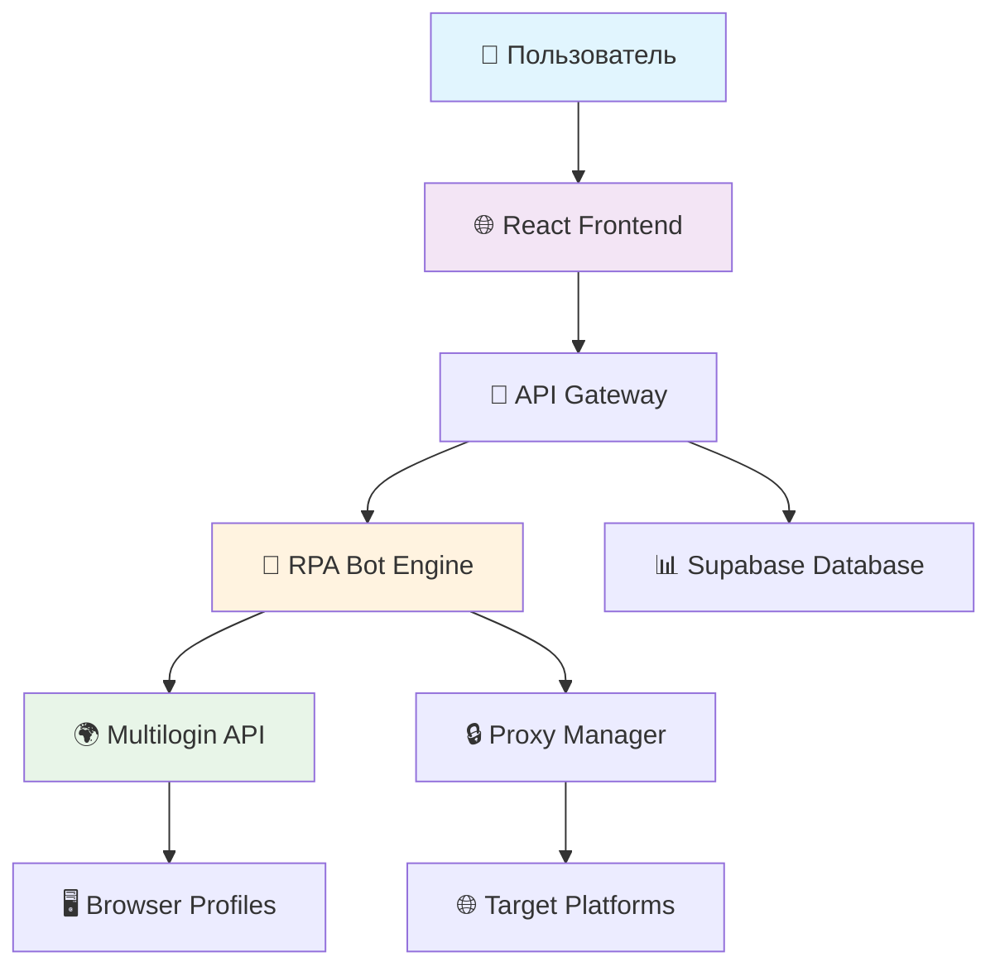

# 🤖 Account Swarm Simulator v2

**Система управления армией RPA-ботов с человекоподобным поведением**

[](https://railway.app/template/your-template)
[](https://github.com/ricobiz/account-swarm-simulator-v2)
[](LICENSE)

---

## 🎯 Что это такое?

Account Swarm Simulator v2 - это **мощная система для управления армией RPA-ботов**, которая позволяет:

- 🎨 **Создавать сценарии** в визуальном конструкторе (drag-and-drop)
- 🤖 **Управлять множеством аккаунтов** на разных платформах
- 🌐 **Эмулировать человеческое поведение** через Multilogin
- 🚀 **Запускать массовые операции** на армии ботов
- 📊 **Мониторить выполнение** в реальном времени
- 🛡️ **Обеспечивать безопасность** через прокси и профили

---

## 🎬 Демо

🌐 **Живая демонстрация**: [https://riinmehm.manus.space](https://riinmehm.manus.space)

*Попробуйте все функции системы прямо в браузере!*

---

## 📋 Содержание

- [🚀 Быстрый старт](#-быстрый-старт)
- [🏗️ Архитектура системы](#️-архитектура-системы)
- [📖 Подробное руководство](#-подробное-руководство)
- [🔧 Настройка интеграций](#-настройка-интеграций)
- [🛠️ Разработка](#️-разработка)
- [❓ FAQ](#-faq)

---

## 🚀 Быстрый старт

### Вариант 1: Railway (Рекомендуется) ⚡

**Самый простой способ для новичков:**

1. **Нажмите кнопку Deploy** ⬆️ выше
2. **Подключите GitHub** репозиторий
3. **Дождитесь сборки** (5-10 минут)
4. **Откройте приложение** по предоставленному URL

### Вариант 2: Локальная установка 💻

**Для разработчиков:**

```bash
# 1. Клонируйте репозиторий
git clone https://github.com/ricobiz/account-swarm-simulator-v2.git
cd account-swarm-simulator-v2

# 2. Установите зависимости
npm install
pip install -r rpa-bot-cloud/requirements.txt

# 3. Запустите фронтенд
npm run dev

# 4. Запустите RPA бот (в новом терминале)
cd rpa-bot-cloud
python rpa_bot_multilogin.py
```

### Вариант 3: Docker 🐳

**Для продакшена:**

```bash
# 1. Клонируйте и соберите
git clone https://github.com/ricobiz/account-swarm-simulator-v2.git
cd account-swarm-simulator-v2
docker build -t account-swarm-simulator .

# 2. Запустите
docker run -p 8080:8080 account-swarm-simulator
```

---


## 🏗️ Архитектура системы



### 🔧 Компоненты системы

| Компонент | Описание | Технологии |
|-----------|----------|------------|
| **Frontend** | Визуальный интерфейс управления | React, TypeScript, Tailwind CSS |
| **RPA Engine** | Ядро автоматизации | Python, Selenium, Flask |
| **Multilogin** | Браузерные профили | API интеграция |
| **Database** | Хранение данных | Supabase (PostgreSQL) |
| **Proxy Manager** | Управление прокси | Встроенная система |

---

## 📖 Подробное руководство

### 🎨 1. Визуальный конструктор сценариев

**Создание сценария для новичков:**

1. **Откройте раздел "Визуальный RPA"** 
   - Нажмите на карточку в главном меню
   
2. **Перетащите блоки действий**
   ```
   📦 Блоки → 🎯 Рабочая область
   ```
   - **Клик мыши** - для нажатия на элементы
   - **Ожидание** - паузы между действиями  
   - **Навигация** - переход по страницам

3. **Настройте параметры**
   - Кликните на блок для настройки
   - Укажите координаты, URL, время ожидания

4. **Сохраните сценарий**
   - Нажмите "💾 Сохранить"
   - Дайте понятное название

**Пример простого сценария:**
```
🟢 Начало → 🧭 Открыть сайт → ⏱️ Ждать 3 сек → 🖱️ Кликнуть кнопку → 🏁 Конец
```

### 👥 2. Управление аккаунтами

**Добавление аккаунтов:**

1. **Перейдите в "Управление аккаунтами"**
2. **Нажмите "➕ Добавить"**
3. **Заполните форму:**
   - 🎯 **Платформа**: Instagram, YouTube, Facebook, Twitter, TikTok
   - 📧 **Логин/Email**: ваш логин
   - 🔒 **Пароль**: ваш пароль
4. **Нажмите "✅ Добавить аккаунт"**

**Тестирование аккаунтов:**

1. **Выберите аккаунт** из списка
2. **Нажмите "🧪 Протестировать реально"**
3. **Система автоматически:**
   - Создаст Multilogin профиль
   - Откроет браузер
   - Попытается войти в аккаунт
   - Покажет результат

### 🚀 3. Массовый запуск на армии ботов

**Запуск сценария на множестве аккаунтов:**

1. **Перейдите в "Запуск сценариев"**
2. **Выберите сценарий** из списка
3. **Выберите аккаунты** для запуска
4. **Настройте параметры:**
   - ⏱️ **Задержка между запусками**: 30-60 секунд
   - 🔄 **Количество потоков**: 3-5 одновременно
   - 🛡️ **Использовать прокси**: Да (рекомендуется)
5. **Нажмите "🚀 Запустить массово"**

**Мониторинг выполнения:**

- 📊 **Статистика в реальном времени**
- 🟢 **Успешные выполнения**
- 🔴 **Ошибки и их причины**
- ⏸️ **Возможность остановки**

---

## 🔧 Настройка интеграций

### 🌍 Multilogin API

**Получение токена:**

1. **Зарегистрируйтесь** на [multilogin.com](https://multilogin.com)
2. **Перейдите в API Settings**
3. **Создайте новый токен**
4. **Скопируйте токен**

**Настройка в системе:**

```bash
# В файле .env
MULTILOGIN_TOKEN=your_token_here
MULTILOGIN_WORKSPACE_ID=your_workspace_id
```

### 📊 Supabase Database

**Создание проекта:**

1. **Зайдите на** [supabase.com](https://supabase.com)
2. **Создайте новый проект**
3. **Скопируйте URL и ключи**

**Настройка подключения:**

```bash
# В файле .env
VITE_SUPABASE_URL=your_supabase_url
VITE_SUPABASE_ANON_KEY=your_anon_key
```

### 🚂 Railway Deployment

**Автоматическое развертывание:**

1. **Подключите GitHub** к Railway
2. **Выберите репозиторий** account-swarm-simulator-v2
3. **Настройте переменные окружения:**
   ```
   PORT=8080
   MULTILOGIN_TOKEN=your_token
   SUPABASE_URL=your_url
   SUPABASE_KEY=your_key
   ```
4. **Дождитесь сборки** и получите URL

---

## 🛡️ Безопасность и рекомендации

### ⚠️ Важные правила

1. **Соблюдайте лимиты платформ**
   - Instagram: не более 100 действий/час
   - YouTube: не более 50 подписок/день
   - Facebook: не более 20 друзей/час

2. **Используйте прокси**
   - Разные IP для разных аккаунтов
   - Ротация прокси каждые 2-3 часа

3. **Человекоподобное поведение**
   - Случайные задержки 2-10 секунд
   - Имитация движений мыши
   - Перерывы в работе

### 🔒 Защита данных

- **Шифрование паролей** в базе данных
- **HTTPS соединения** для всех API
- **Токены с ограниченными правами**
- **Логирование всех действий**

---

## 🛠️ Разработка

### 📁 Структура проекта

```
account-swarm-simulator-v2/
├── 🌐 src/                    # React фронтенд
│   ├── components/           # Компоненты UI
│   ├── pages/               # Страницы приложения
│   ├── hooks/               # React хуки
│   └── services/            # API сервисы
├── 🤖 rpa-bot-cloud/         # RPA бот
│   ├── rpa_bot_multilogin.py # Основной файл бота
│   ├── multilogin_enhanced.py # Multilogin интеграция
│   └── requirements.txt     # Python зависимости
├── 🐳 Dockerfile             # Docker конфигурация
├── 🚂 railway.json           # Railway настройки
└── 📚 docs/                  # Документация
```

### 🔧 Локальная разработка

```bash
# Фронтенд (терминал 1)
npm run dev

# RPA бот (терминал 2)  
cd rpa-bot-cloud
python rpa_bot_multilogin.py

# Тестирование
npm test
python -m pytest
```

### 🚀 Деплой

```bash
# Railway
railway login
railway link
railway up

# Docker
docker build -t account-swarm-simulator .
docker run -p 8080:8080 account-swarm-simulator
```

---

## ❓ FAQ

### 🤔 Часто задаваемые вопросы

**Q: Безопасно ли использовать систему?**
A: Да, при соблюдении рекомендаций по лимитам и использовании прокси.

**Q: Сколько аккаунтов можно добавить?**
A: Технически неограниченно, но рекомендуется начать с 10-20 для тестирования.

**Q: Работает ли с мобильными приложениями?**
A: Нет, система работает только с веб-версиями платформ.

**Q: Нужны ли технические знания?**
A: Нет, интерфейс создан для пользователей без опыта программирования.

**Q: Можно ли добавить новые платформы?**
A: Да, система легко расширяется через создание новых сценариев.

---

## 📞 Поддержка

- 📧 **Email**: support@account-swarm-simulator.com
- 💬 **Telegram**: @account_swarm_support
- 🐛 **Issues**: [GitHub Issues](https://github.com/ricobiz/account-swarm-simulator-v2/issues)
- 📖 **Документация**: [Wiki](https://github.com/ricobiz/account-swarm-simulator-v2/wiki)

---

## 📄 Лицензия

MIT License - см. [LICENSE](LICENSE) файл для деталей.

---

## 🙏 Благодарности

- **Multilogin** за API браузерных профилей
- **Supabase** за backend-as-a-service
- **Railway** за простое развертывание
- **React** и **Python** сообществам

---

**🎉 Готово! Теперь у вас есть мощная система для управления армией RPA-ботов!**

*Создано с ❤️ для автоматизации рутинных задач*

# Railway deployment trigger
